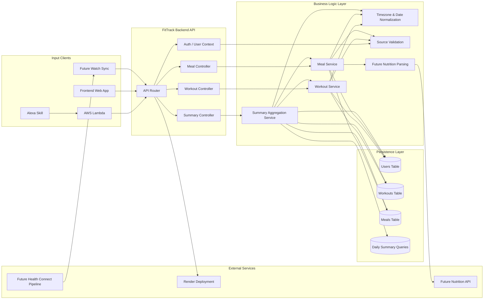
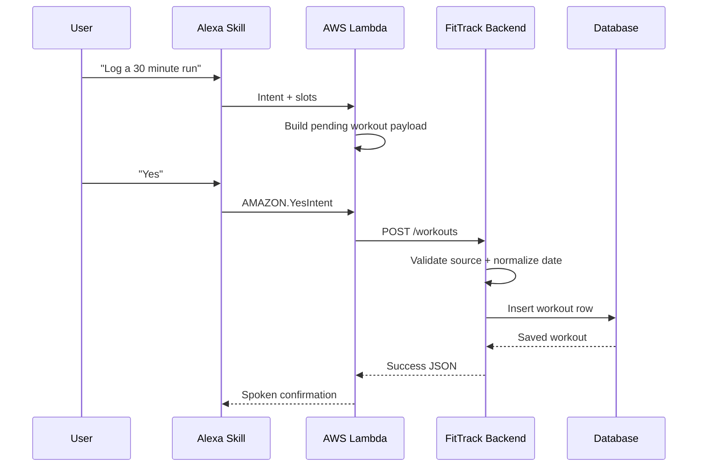

# FitTrack Backend

FitTrack Backend is the API layer for the FitTrack project. It receives data from Alexa through AWS Lambda, stores workouts and meals, and returns daily summaries for frontend and voice consumption.[cite:95]

## Overview

The backend is hosted on Render and serves as the core source of truth for workouts, meals, and calorie summaries in the FitTrack system.[cite:95] It sits between the Alexa skill and the frontend, which means both voice responses and dashboard views depend on backend correctness.[cite:95]

## Roadmap
Project planning and architecture for the FitTrack system are maintained in an Obsidian vault. The vault includes dedicated notes for the backend API, Alexa integration, frontend UI, and overall roadmap, with heavy cross-linking between them. This README summarizes the backend-specific parts of that Obsidian plan so the repository stays aligned with the broader project design.

## Backend Architecture


## Request Flow



## Repository

- GitHub repository: <https://github.com/atharvamavle/fittrack-backend>[cite:96]
- Production base URL: `https://fittrack-backend-i1db.onrender.com/api`.[cite:95]

## Role in the System

The documented project architecture defines the backend as the persistence and business-logic layer for the whole app.[cite:95] Alexa sends workout and meal data to the backend, and the frontend is expected to read the same stored data through API endpoints.[cite:95]

## Current Responsibilities

Based on the project documentation, the backend currently does the following:[cite:95]
- Accepts workout creation requests through `POST /workouts`.[cite:95]
- Accepts meal creation requests through `POST /meals`.[cite:95]
- Returns daily summary data through `GET /summary`.[cite:95]
- Stores workouts, meals, and derived daily calorie information in the database.[cite:95]

## Confirmed Working Behavior

The current project notes confirm that Alexa-triggered workout requests successfully create workout rows in the database through the backend.[cite:95] The summary endpoint also responds with burned, eaten, and net calorie values that Alexa can read aloud, even though the returned values are currently wrong in some same-day scenarios because of timezone handling.[cite:95]

## API Endpoints

The current documented endpoint surface is:[cite:95]

| Endpoint | Method | Purpose |
|---|---|---|
| `/workouts` | POST | Save a workout sent from Alexa or manual entry |
| `/meals` | POST | Save a meal entry |
| `/summary` | GET | Return calories burned, calories eaten, and net calories |

### Expected workout payload

The Alexa integration flow documents a payload with fields such as these:[cite:95]

```json
{
  "workout_type": "run",
  "duration_minutes": 30,
  "intensity": "medium",
  "source": "alexa"
}
```

### Expected meal payload

The current meal flow is still primitive, but the documented pending payload shape includes fields such as:[cite:95]

```json
{
  "meal_type": "meal",
  "food_name": "100 grams chips and 2 rotis",
  "quantity_g": 100,
  "source": "alexa"
}
```

## Recommended Data Model

A practical backend model for this project should include at least these entities:

### Users
- `id`
- `email` or provider identifier
- `timezone`
- `created_at`

### Workouts
- `id`
- `user_id`
- `date`
- `workout_type`
- `duration_minutes`
- `calories_burned`
- `source`
- `created_at`

### Meals
- `id`
- `user_id`
- `date`
- `food_name`
- `quantity_g`
- `calories`
- `protein`
- `carbs`
- `fat`
- `source`
- `created_at`

## Known Issues

### 1. Timezone mismatch
The biggest documented backend bug is the date mismatch between Alexa logging time and summary calculation, caused by UTC versus AEST handling.[cite:95] This makes the backend return a summary of 0 for the user's real current day even when workouts were just saved.[cite:95]

### 2. Source field bug
The project documentation states that the backend stores Alexa-generated workouts as Manual even when the request body sends `"source": "alexa"`, which strongly suggests the schema or controller is defaulting or overriding that field.[cite:95]

### 3. Meal nutrition is not real yet
Meal entries are not yet backed by a nutrition API, so the backend cannot produce reliable calorie or macro totals for food logging until that integration is built.[cite:95]

## Priority Fixes

The near-term project plan is clear about what should happen next:[cite:95]

1. Fix timezone and date handling end to end.[cite:95]
2. Fix source mapping so `alexa` is stored correctly.[cite:95]
3. Add nutrition API support for real meal calories and macros.[cite:95]

## Recommended API Improvements

To make the backend actually usable beyond the current demo state, these changes are the right next step:

### Add explicit date handling
- Accept `date` in workout and meal payloads.
- Store the date directly rather than inferring from server timezone.
- Allow `GET /summary?date=YYYY-MM-DD`.

### Add read endpoints
If not already implemented, add:
- `GET /workouts`
- `GET /meals`
- `GET /workouts/:id`
- `GET /meals/:id`

Without read routes, the frontend cannot become a serious dashboard.

### Add per-user scoping
The current project notes explicitly identify missing account linking and user identity as a limitation.[cite:95] The backend should scope all stored data by user as soon as authentication or account linking is introduced.[cite:95]

## Suggested Local Development Setup

The exact stack is not fully documented, so these commands are generic and should be adapted to the framework actually used in the repository.

```bash
git clone https://github.com/atharvamavle/fittrack-backend.git
cd fittrack-backend
npm install
npm run dev
```

## Recommended Environment Variables

These are typical variables the backend likely needs or should have:

```env
PORT=5000
DATABASE_URL=<your_database_url>
CORS_ORIGIN=<your_frontend_url>
TIMEZONE=Australia/Melbourne
NUTRITION_API_KEY=<future_api_key>
```

If the stack is Python or another runtime rather than Node, adjust the command and env layout accordingly.

## Integration with Alexa

The Alexa Lambda uses Python's `urllib.request` to call this backend rather than external packages, which keeps the voice integration lightweight in Lambda hosting.[cite:95] The backend therefore needs stable JSON contracts, fast responses, and clear failure messages because voice experiences break badly when the API is slow or inconsistent.[cite:95]

## Integration with Frontend

The frontend repository is intended to consume this backend as its main data source.[cite:96] That means the backend should prioritize stable read endpoints, consistent response shapes, and correct date semantics before cosmetic feature work.[cite:95]

## Roadmap

The current backend roadmap implied by the project planner is:[cite:95]
- Stabilize core logging and summary correctness.[cite:95]
- Support real food parsing and macro calculation.[cite:95]
- Add account linking and user-aware storage.[cite:95]
- Later explore watch integration through Android or related tooling.[cite:95]
- Only after stable data exists should habit prediction or smart reminders be added.[cite:95]

## Practical Warning

Do not waste time building advanced AI features on top of a backend that still has wrong dates, wrong sources, and incomplete meal calories. Fix data correctness first or everything above it becomes unreliable.[cite:95]
